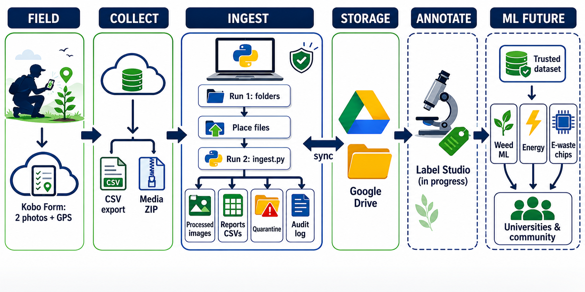

# Citizen AI — ML Dataset

Public notes and summaries from volunteer work on **Citizen AI (CAI) / Abundance Federation**: infrastructure for community-sourced agricultural image datasets used in machine learning.

> **Note:** Production code and pilot data live in **private** organization repositories. This repo is documentation and portfolio material only — not a source dump.

---

## What’s here

| Area | Status | Summary |
|------|--------|---------|
| [Ingestion pipeline](./ingestion/) | Documented | Field submissions (Kobo) → validated, training-ready images |
| Orchestrator | Coming soon | Submission lifecycle, storage, annotation handoff |

Each folder is meant to stand alone for a LinkedIn / portfolio write-up while still fitting the same project story.

### Ingestion hardening (P0)

Priority-0 checks in the pilot ingestion script (full detail in [ingestion/](./ingestion/)):

| ID | Measure |
|----|---------|
| P0-1 | File size hard cap |
| P0-2 | Image corruption detection |
| P0-3 | Format whitelist (magic numbers) |
| P0-4 | Image bomb / pixel limit |
| P0-5 | EXIF stripping |
| P0-6 | Filename sanitization |
| P0-7 | SHA-256 exact duplicate detection |
| P0-8 | CSV parsing robustness |
| P0-9 | Text sanitization |
| P0-10 | Structured audit logging |

---

## Project context

**Pilot 01** collects weed / agricultural photos from volunteers in the field. Raw mobile-form exports are not training-ready: metadata is messy, files vary in quality, and bad inputs must not silently enter the active dataset.



*Pilot 01 macro flow — volunteer capture through ingestion, storage, annotation, and downstream ML use.*

The long-term shape:

```text
Capture (Kobo)
    → Ingestion / validation
    → Orchestrator (stewardship, workflows)
    → Annotation
    → Training-ready dataset
```

This repo tracks the **public side** of that story as pieces mature.

---

## About

Volunteer contribution — data engineering and ML data infrastructure for Citizen AI (CAI).

Questions or similar field-collected dataset work: reach out via LinkedIn.
