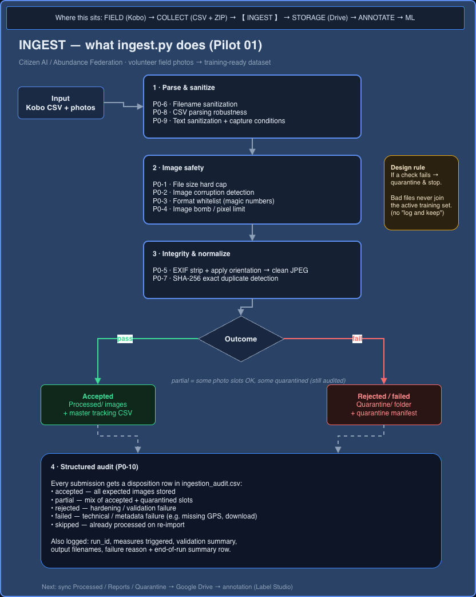

# Ingestion pipeline

Python ingestion for Pilot 01: turn volunteer field submissions into a trustworthy image set for ML.

> Implementation remains in a private org repo. This page covers problem, design, and decisions.

**Where this sits in the project**

```text
FIELD (Kobo) → COLLECT (CSV + media ZIP) → INGEST (this page) → STORAGE → ANNOTATE → ML
```


*Pilot 01 macro flow — this page covers the **INGEST** stage in detail.*

---

## Problem

Training data for agricultural ML rarely arrives clean. Field submissions come via Kobo (CSV + photos), with variable quality and real risk of bad or duplicate inputs entering the active dataset.

A weak ingestion step contaminates annotation, training, and evaluation downstream.

**Goal:** raw submissions → **training-ready** images, with explicit failure handling.

---

## Role

**Data Engineer — ML Dataset Ingestion & Validation** (volunteer)

Built and hardened a pipeline that validates images/metadata, quarantines failures, deduplicates by content hash, and writes structured audit outcomes per submission.

---

## How the script behaves



*What `ingest.py` does — P0 hardening grouped by stage. Editable source: [`ingest-deep-dive.drawio`](./ingest-deep-dive.drawio).*

**Core rule — reject on failure (not “log and keep”):**  
If a validation check fails, that submission (or photo slot) is **quarantined** and does **not** enter the active training set. Operators can still see *why* via the quarantine manifest and audit log. The active tracker only lists accepted images.

```text
Kobo CSV + photos
        │
        ▼
1. Parse & sanitize     (P0-6, P0-8, P0-9)
        │
        ▼
2. Image safety         (P0-1 … P0-4)
        │
        ▼
3. Integrity / normalize (P0-5, P0-7)
        │
   ┌────┴────┐
accept     reject
   │         │
   ▼         ▼
Processed/  Quarantine/
+ tracking  + manifest
   │         │
   └────┬────┘
        ▼
4. Audit log (P0-10) — disposition per submission + run summary
```

---

## Hardening measures (P0)

These are the priority-0 checks implemented in the pilot ingestion script. The diagram groups them by stage; this table is the full list.

| ID | Measure | What it does |
|----|---------|--------------|
| P0-1 | File size hard cap | Reject oversized files before heavy image processing |
| P0-2 | Corruption detection | Verify image can be opened; quarantine corrupt files |
| P0-3 | Format whitelist | Accept JPEG/PNG by **magic numbers** (not just extension); normalize to clean JPEG |
| P0-4 | Image bomb protection | Cap pixel count / decompression risk |
| P0-5 | EXIF stripping | Apply orientation visually; strip metadata from outputs |
| P0-6 | Filename sanitization | Strict allowlist on metadata used in output names (path-injection safe) |
| P0-7 | Exact duplicate detection | SHA-256 registry; quarantine byte-identical repeats |
| P0-8 | CSV parsing robustness | Safer CSV read; skip/log malformed files/rows when possible |
| P0-9 | Text sanitization | Clean/limit text fields; require capture-condition fields when mandatory |
| P0-10 | Structured audit logging | Per-submission disposition + measures triggered + run summary |

---

## Outputs (kept separate on purpose)

| Artifact | Purpose |
|----------|---------|
| Active tracking CSV | **Accepted** images only |
| Quarantine + manifest | Rejected / problematic files and reasons |
| Hash registry | First-seen SHA-256 for exact duplicate detection |
| Audit log | Disposition history (`accepted` / `partial` / `rejected` / `failed` / `skipped`) |

### Dispositions (P0-10)

- `accepted` — expected images passed and were stored  
- `partial` — some photo slots OK, some failed  
- `rejected` — hardening / validation failure  
- `failed` — technical / metadata failure (e.g. missing GPS, download error)  
- `skipped` — already processed on re-import  

---

## Stack

Python · pandas · Pillow · requests · CSV manifests / audit trails

---

## Status

Pilot-stage ingestion with P0 hardening for a trusted volunteer collection context. This logic is intended to feed the broader [orchestrator](../) (coming soon).
